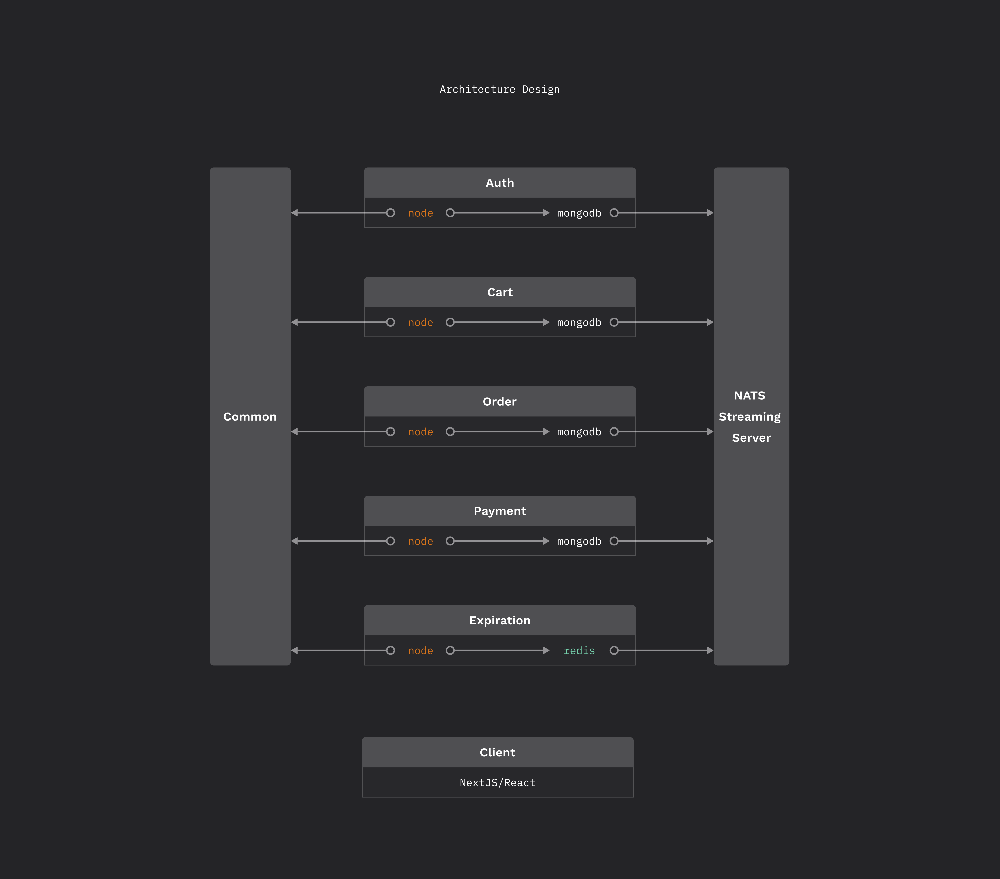
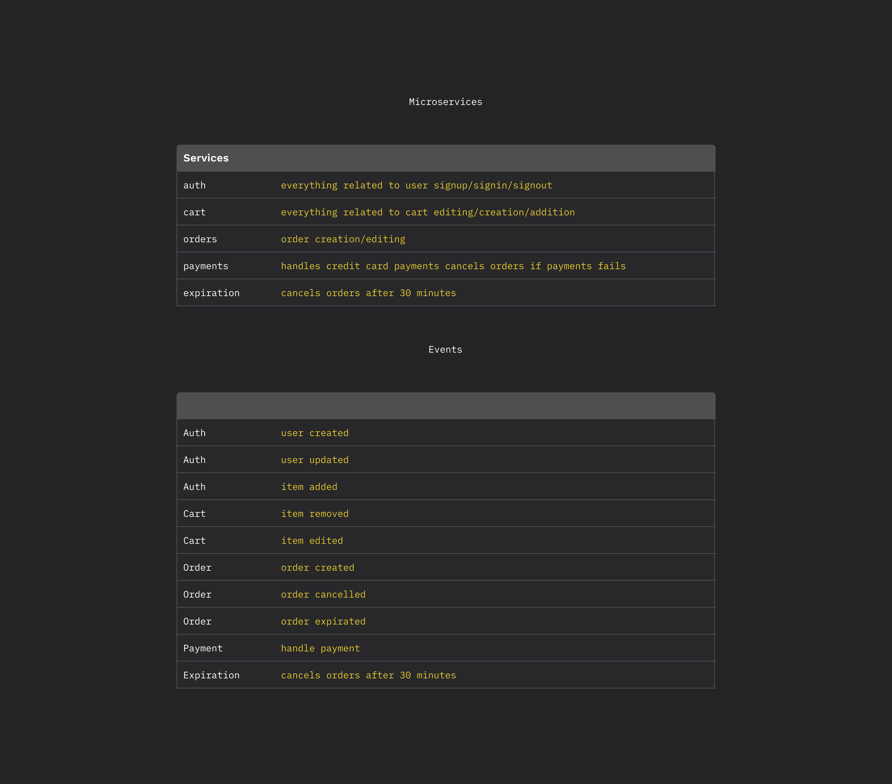

## Work in progress

Here are screenshots of the backend:

Problems:

-   Each microservice may run a different backend framework. Creating an error reponse object that will work across different microservices is problem. How to do I create a standardized error response object that works across different microservices that may use different frameworks (ruby on rails, java spring, node + express etc.)?
-   **Solution**: Need a structured error response from all servers => write error handling middleware process. Each error needs to be handled consistently => capture all possible errors using express's error handling mechanism (aka call next())
